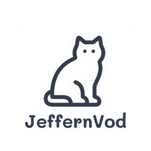

---
## 🎬  Jeffern影视平台（可封装LibreTV/MoonTV/Emby/已内置影视资源）MAC端（Objective-C）
<p align="center">
  
</p>

<p align="center">
  
  
  
  
</p>

- ✨Jeffern观影平台是一款基于 macOS 原生开发（Objective-C + Cocoa） 的桌面端影视播放平台，可将影视站打包成独立的Mac应用，支持自定义影视源,内置了一些影视资源  
- ✨本软件旨在提高自建影视站如 [LibreTV](https://github.com/jeffernn/LibreTV),[MoonTV](https://github.com/senshinya/MoonTV)项目,自建Emby服务器在Macos上的观影便捷性，同时为不会部署或无条件部署的用户提供一些内置影视资源
- ✨本软件内置了一些影视源，可点击顶部状态栏中的内置影视切换观看（内置影视的加载速度取决于你的网速，可能因为网络环境问题加载慢或无法加载，切换或开启优选网站自动优选功能）
- ⚠️Emby因被滥用原因导致被封禁，请自定义Emby服务器，欢迎大佬贡献🙏
- ✨如需要使用Emby（Android TV端）突破高级会员限制，封装成安卓电视TV应用（安卓手机也可用，适配度可能较差），请点击[Jeffern-TV-for-Emby](https://github.com/jeffernn/JeffernTV-for-Emby-crack)
- ✨如需使用其他端（windows）请点击[LibreTV-Mac-Python](https://github.com/jeffernn/LibreTV-Mac-Python)
- 🎉欢迎大佬加入项目开发，有想添加/贡献/分享的影视站/Emby服务器可以在issue中/TG群与我联系
  
---
## 🧭  快速入门

- ✨首次会弹出窗口可选择添加你所自建的[LibreTV](https://github.com/jeffernn/LibreTV)/[MoonTV](https://github.com/senshinya/MoonTV)网址后按✨✨✨确认或回车，也可选择内置影视源
- ✨点击功能列表菜单栏清除缓存即可删除本软件的本地所有缓存内容(重新设置自建的LibreTV/MoonTV/封装的影视站)
- ✨点击顶部菜单栏中的内置影视菜单可观看免费的内置影视内容（无需搭建LibreTV/MoonTV/Emby服务器）
- ✨点击内置影视菜单中的✨✨✨可回到设置的LibreTV/MoonTV
- ✨点击内置影视Emby站可设置内置服务器
- ✨点击内置Emby可访问内置Emby服务器，鼠标停留进入二级菜单可自定义Emby服务器
- ✨点击观影记录可以查看你的历史浏览记录
- ✨点击功能列表中的优选网站，可自动检测网站下次可自动打开最快的网站

<p align="center">

</p>
 <p align="center">
  
 </p>
 <p align="center">
  
 </p>
 <p align="center">
  
 </p>
 <p align="center">
  
 </p>
 <p align="center">
  
 </p>
 <p align="center">


</p>
<p align="center">
  
  
</p>

---
## ‼️‼️‼️ 放大/缩小内置影视视频

- ✨部分平台有内置网页放大/样式全屏点击即可放大（全局放大按钮左侧）


- ✨部分内置影视视频因影视站不支持等因素无法放大（若发现无红色按钮请使用播放器网页放大/全局放大功能），现注入一个新的放大/缩小按钮，使用流程如下：
- ①将鼠标移动至网站的最右侧（此时会出现红色➕按钮）点击红色加号按钮即可放大/缩小视频（不是播放器内的红色按钮）。
- ②红色加号按钮默认不显示将鼠标移动至网页最右侧后即显示，同时鼠标停留在按钮超过1S后也会自动隐藏，需再次放大/缩小请将鼠标移动至任意位置后再移动到最右侧，出现红色加号按钮后点击即可。
  


---
## ‼️‼️‼️ 使用优选网站，下次自动打开最佳观影站

- ✨使用流程如下：
- ①点击功能列表
- ②点击优选网站
- ③点击立即检测（若要下次自动打开最快延迟最低影视站请勾选右侧按钮，已屏蔽自动优选非观影类的内置影视）
  


- 优选影视功能可以自动监控应用内置的影视站点和用户自定义添加的站点，按需检查网站的可用性，当网站状态发生变化时会发送通知提醒用户。支持自动打开响应速度最快的站点。为避免缓存过多导致无用数据积累，系统会在第三次启动应用时自动清理缓存。
- **自动同步**：自动监控所有内置影视站点和用户自定义站点（排除非观影类的内置影视）
- **按需检查**：启动时检查一次，需要时手动触发检查
- **状态检测**：检测网站是否在线、离线或出现错误
- **响应时间**：记录网站响应时间，按速度排序显示
- **连续失败统计**：记录连续失败次数
- **缓存管理**：第三次启动时自动清理缓存，避免数据过多
- **自动打开最快站点**：可设置启动时自动打开响应速度最快的在线站点
- **智能排序**：在线站点优先显示，按响应时间升序排列
  
---
## ‼️ 重置LibreTV/MoonTV自建影视站网址

- ✨方法一：点击内置影视，展开✨✨✨，点击重新封装
- ✨方法二：进行如下操作
- ①点击菜单栏中的清除缓存后软件会自动重启
- ②在弹出的窗口中点击✨✨✨即可重新设置
  
---
## ‼️ 自定义/恢复默认Emby服务器

- ①点击菜单栏中的内置影视
- ②选中Emby进入二级菜单
- ③点击自定义Emby/恢复默认
- ✨ 点击菜单可直接进入Emby，二级菜单只是展示拓展功能
  
---
## ‼️ 添加自定义站

- ①点击菜单栏中的自定义站
- ②点击添加站点
- ③添加的站点会显示在列表中，可展开对其删除或编辑
- ✨ 点击菜单可直接自定义站，二级菜单只是展示拓展功能
  
---
## ‼️应用(app)无法打开,因为Apple无法检查其是否含有恶意软件（因为没有发布到APPSTORE，属正常情况，可自行下载代码审查）：

- ①通过系统偏好设置“仍要打开”
- ②打开“系统偏好设置/设置”，然后点击“安全性与隐私”.
- 
- ③在“通用”选项卡下（新版本为隐私与安全性），向下滑动找到安全性如果看到“已阻止使用，因为...”，点击“仍要打开”按钮.
- ④系统会再次提示，再次点击“打开”即可.
- 🌟不同macos版本显示略微不同，操作类似，若找不到一致信息可将报错提示自行google或询问AI解决
  
---
## ‼️双击app出现提示"文件已损坏，打不开"等提示。

- 解决方法：请在终端输入以下代码，并输入电脑密码，再次打开app文件即可。
  
	```
	sudo spctl --master-disable
	```

---
## ‼️提示需要安装FlashPlayer才能播放。

- 请先安装FlashPlayer及允许。


---

## ‼️MAC软件提示已损坏，需要移到废纸篓的解决方法

- 允许任何来源的应用。在系统偏好设置里，打开“安全性和隐私”，将“允许从以下位置下载的应用程序”设置为“任何来源“。当然，这个设置已经无法在Mac OS Sierra上完成了。
在Mac OS Sierra上，应该进行以下操作：

- 打开终端（Terminal），输入以下命令后回车，输入密码 </br>

	``` 
	sudo spctl --master-disable 
	```

---

## ‼️设置应用打开默认页？

- 勾选内置影视/自定义站菜单下的记录当前站点
- 下次打开即是最后一次使用应用访问的站点了

---

## ‼️将Emby封装为客户端？

- 点击内置影视菜单栏下的Emby，展开二级菜单
- 点击二级菜单中的编辑填写你的Emby网址，账号，密码（软件之后会自动帮你填写登陆）
- 二级菜单中可以恢复内置的Emby服务器（已停用）
- 点击内置影视菜单中的Emby即可访问
- 可勾选记录当前站点，作为临时主页

---

## ✨  功能简介

- ✨ 支持自定义视频源网址（LibreTV/MoonTV）
- ✨ 支持全屏播放（LibreTV/MoonTV使用播放器中的网页全屏，内置影视请看以上教学）
- ✨ 点击顶部菜单栏清除缓存可清除所有缓存（重新设置LibreTV/MoonTV自建网址）
- ✨ 点击内置影视可观看免费的内置影视（会持续更新）
- ✨ 自带拦截影视站视频源恶意广告（影视源中途的插片广告）
- ✨ 无需复杂的部署过程，直接下载安装包(请在Releases处下载最新版本)即可使用，告别配置烦恼
- ✨ 预加载常用站点或视频片段，提升加载速度，减少等待时间。会自动统计历史记录中访问频率最高的3个影视站，在应用启动时后台预加载这些站页面资源
- ✨ 防止休眠/锁屏
- ✨ 崩溃恢复/会话恢复
- ✨ 可自动检测更新并在应用中无感自动更新替换
- ✨ 观影记录查询
- ✨ 自动优选影视站下次自动打开最快的影视站
- ✨ 项目完全开源，代码透明，无任何跟踪或广告

---

## 🛠️  技术栈

- **Objective-C**
- **Cocoa（AppKit）**
- **WebKit**（用于网页内容嵌入与播放）
- **Xcode 工程**

---

## 🏗️  自行打包攻略

- ✨使用github action打包
- ✨使用本地打包
  
1. **环境要求**
   - macOS 10.12 及以上（M芯片及通用类型打包需高于macos12）
   - Xcode 10 及以上

2. **打包为独立应用**
   - 在 Xcode 菜单栏选择 `Product` -> `Archive` 进行归档后Build为独立应用
---

## ✨  将LibreTV封装成iPad端桌面级应用（MoonTV同理）

①点击Safari分享按钮


②点击添加到主屏幕


③设置应用名字


④打开应用


---

## ✨ 将Emby封装成Android TV客户端？（Android手机端）

- ✨Emby（Android TV端）突破高级会员限制，封装成安卓电视TV应用（安卓手机也可用，适配度可能较差），请点击[Jeffern-TV-for-Emby](https://github.com/jeffernn/JeffernTV-for-Emby-crack)
  
<p align="center">

</p>
<p align="center">

</p>
<p align="center">

</p>
  
---

### ✨✨✨福利

- 啦啦～
- 看到这里啦！说明你认真熟读了README，我必须送你一些专属福利～
- ⬇️⬇️Emby客户端（macos/ipados/ios）高级订阅会员破解脚本⬇️⬇️
- https://github.com/jeffernn/jeffern-qx/blob/main/%E9%87%8D%E5%86%99/Embypremiere/Embypremiere.conf
- 配合Quantumult x使用，懂得都懂！切勿外传哦～

---

### 🚨 重要声明

- 本项目仅供学习和个人使用
- 请勿用于商业用途或公开服务（**禁止用于任何商业用途**）
- 如因公开分享导致的任何法律问题，用户需自行承担责任
- 项目开发者不对用户的使用行为承担任何法律责任
- 如有问题或建议，欢迎提交 Issue
- 如需分支项目请引用本项目地址
- 如需要将Emby突破高级会员限制，封装成安卓电视TV，请点击[Jeffern-TV-for-Emby](https://github.com/jeffernn/JeffernTV-for-Emby-crack)
- 其他端（windows）的部署可参考[LibreTV-Mac-Python](https://github.com/jeffernn/LibreTV-Mac-Python)版本进行修改后自行打包


---

## ⚠️ 免责声明

JeffernMovie 仅作为视频搜索工具，不存储、上传或分发任何视频内容。所有视频均来自第三方影视站提供的搜索结果。如有侵权内容，请联系相应的内容提供方。

本项目开发者不对使用本项目产生的任何后果负责。使用本项目时，您必须遵守当地的法律法规。

---

## 🚀 欢迎加入我们的 Telegram 社区！

[](https://t.me/+vIMxDGDIWiczMTE1)

欢迎加入我们的 Telegram 群，获取最新动态、分享创意、与志同道合的朋友交流！🌟

---

## 🌟 Star History

[](https://starchart.cc/jeffernn/LibreTV-MoonTV-Mac-Objective-C)

---

<p align="center">
  <b>⭐ 如果这个项目对你有帮助，请给个 Star 支持一下！</b>
</p>
